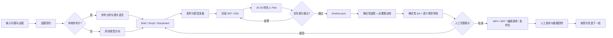

# AI 产品经理创作者工作流

版本：1.0（2026-08-03）

这套流程服务的是一个多项目账号，而不是某一个量化项目：

> 一个 AI 产品经理，利用下班后的碎片时间，把真实想法从 0 做成可验证项目，并公开过程、结果、踩坑和方法。

量化项目只是第一个案例。后续可以换成内部工具、AI 工作流、个人效率产品、数据产品或自动化服务，只要每条内容都回到“有限时间里如何做出可验证结果”。账号策略的机器可读来源是 [`config/creator-workflow.yaml`](../config/creator-workflow.yaml)。

## 你给什么，我能稳定产出什么

最低输入不是一篇完整稿子，而是三件事：

1. 一个具体问题、冲突或项目节点，例如“AI 写完代码后为什么仍不允许上线”；
2. 一个可核实的事实来源，例如项目文件、日志、录屏、截图或你的口述（待确认事实会被标出来）；
3. 允许公开的边界，例如哪些数据要打码、哪些项目不能出现、是否可以使用你的声音。

可选输入包括本地参考视频、参考链接、语音、音乐、项目文件、发布后的数据截图。没有本地参考视频时，系统可以做原创内容；只有链接时，只能提炼页面可见的结构假设，不能声称逐帧看过或复刻了视频。

## 参考视频必须分清证据等级

之前的抖音研究台账记录了页面和可见文案，但“A 级页面核验”不等于保留了原片逐帧证据。这是之前视频质量判断不够扎实的原因之一。以后按以下规则执行：

| 输入 | 可以判断 | 不可以声称 |
|---|---|---|
| 只有 URL/页面 | 标题、页面可见文案、公开结构线索 | 完整看过画面、节奏、声音或字幕细节 |
| 有授权本地视频 | `ffprobe` 参数、转写、镜头边界、关键帧、联系表、采样帧、声音结构 | 复制原文案、原素材或原案例 |
| 用户另外提供人工笔记 | 笔记中的明确观察（标记来源和置信度） | 把推测写成客观事实 |

本地参考片会先进入 `analyze-reference`，再由 `video-shotcraft` 只提供镜头语法、节奏和声音设计参考；主渲染仍走 AVS 的 `timeline.json` 与确定性装配。真人口播 + 录屏专题还必须遵守 [字幕驱动的录屏专题制作规范](subtitle-driven-screen-documentary.md)：先有词级 SRT 与 20-30 秒试片，后做全片。改编时必须替换文案、配音、素材、案例、数据、观点、标题和封面。

## 一条内容的完整链路



### 阶段与交付

| 阶段 | 主要负责 | 关键产物 | 不能跳过的门槛 |
|---|---|---|---|
| 选题契约 | Agent + 用户选一个 | 问题、主行为、赌注、成功信号 | 一条内容只能有一个主行为 |
| 事实与参考 | Agent | 事实台账、`reference-recipe.json`、镜头笔记 | 每个结论有来源或明确“需确认” |
| 内容 | Agent | `brief.md`、`script.json`、`storyboard.json` | 每段脚本有 `source_refs`，缺口单列 |
| 素材与声音 | Agent | `asset-manifest`、旁白、音频计划 | 缺素材不拿无关 B-roll 硬凑 |
| 编辑与动效 | Agent | `timeline.json`、clean/captions MP4、SRT | 旁路产物回挂 Episode，不伪造状态 |
| QA 与批准 | Agent + 用户 | QA、视觉审核、编辑说明 | 事实、可读性、音画关系和批准都通过 |
| 发布与复盘 | 用户 + Agent | 平台文案、数据快照、下一批实验 | 人工发布；一次数据不宣布规律 |

## 账号内容如何多样但不发散

主系列是《下班后 0→1》，内容支柱按比例运行：

- 35% 项目日志：推进一个真实节点；
- 25% AI 产品经理判断：给一个可迁移的取舍框架；
- 15% 工具/Skill 实测：展示真实输入、输出和边界；
- 15% 失败与验收复盘：公开错误、证据和修复；
- 10% 变现实验：记录小产品如何验证，不夸大收入。

每条内容都包含：具体问题、真实动作、证据画面、当前结论、下一步承诺。这样项目可以变化，观众仍然知道关注你能获得什么。

## 赚钱路径

不先赌广告或爆款，按证据逐级验证：

1. 免费：项目拆解清单、AI PM 验收模板、视频检查表，验证收藏、关注和有效私信；
2. 39-99 元：把反复被索取的部分整理成 `AI 项目 0→1 模板包`；
3. 299-999 元：出现明确问题型需求后，再提供一次性项目诊断或工作流梳理；
4. 3000-15000+ 元：有多个可展示项目证据后，才开放有范围、有里程碑、有保密边界的企业陪跑。

每批内容只改变一个主要变量。播放量不能直接证明收入，收入也不能反推内容方法；复盘只记录证据和置信度。

## 你和我的固定分工

我负责选题池、内容契约、事实台账、脚本、分镜、素材清单、配音草稿、剪辑、字幕、封面候选、发布文案、QA 和数据复盘。你不需要学习剪辑或插件，只需要提供真实信息、确认公开边界、完整看片批准、人工发布并带回后台数据。每条内容的目标投入是 10-20 分钟。

缺少素材、Provider 或授权时，我会停在明确的 `WAITING_FOR_INPUT` / `BLOCKED`，列出缺口和替代方案；但“新口播没有逐句同步录屏”不是缺素材，必须使用已有真实画面池重新映射。不会把“做出来了”写成“能发布”或“能赚钱”。

## 复用入口

```powershell
python -m avs episode create EP-YYYYMMDD-01 --mode REFERENCE_ADAPT
python -m avs workflow resume EP-YYYYMMDD-01
python -m avs workflow next EP-YYYYMMDD-01 --json
```

项目 Skill [`creator-workflow`](../skills-src/creator-workflow/SKILL.md) 负责先读取账号契约，再把内容交给既有 `analyze-reference`、`write-video-script`、`create-storyboard`、`prepare-assets`、`create-rough-cut`、`quality-review` 和 `create-publish-pack`。确定性命令由 CLI 续跑，事实、素材、最终批准和发布永远保留人工关口。
